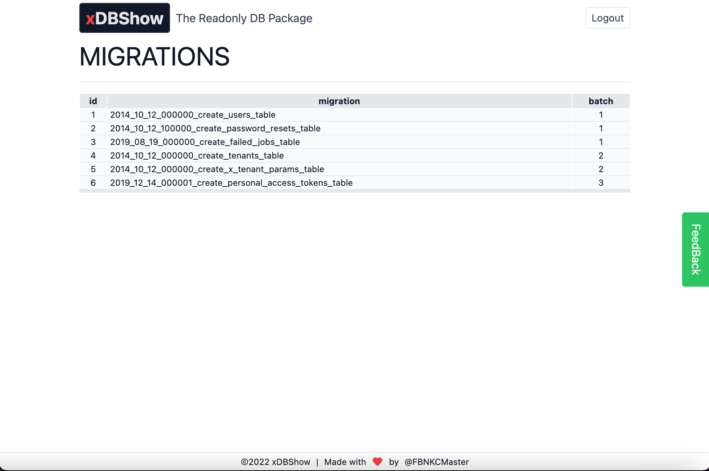

# 

> ### xDBShow is a Laravel package that let you browse your database easily. Think of it like a read-only PhpMyAdmin for your deployed Laravel application.

[](https://packagist.org/packages/fbnkcmaster/xdbshow)
[](https://packagist.org/packages/fbnkcmaster/xdbshow)


------

## Preview

##### Listing Tables


##### Browsing a Table



------

## Installation

You can install the package via composer:

```bash
composer require fbnkcmaster/xdbshow
```

Then publish its assets:
```bash
php artisan vendor:publish --tag=xdbshow --force
```

To publish the config run this command:
```bash
php artisan vendor:publish --provider="FBNKCMaster\xDBShow\Providers\ServiceProvider" --tag="config" --force
```

## Usage

You can access the interface via the default route:
```bash
https://[yourdomain.tld]/admin/xdbshow
```

Before you can access this endpoint, you should specify the name of the admin middleware in the config file (change 'auth_admin_middleware' => null). Otherwise, we assume that you have an "isAdmin()" method in the User model of your application.

In the config file you can also specify "hidden_tables" and "hidden_columns" you don't want to display.

### Testing

```bash
composer test
```

### Changelog

Please see [CHANGELOG](CHANGELOG.md) for more information what has changed recently.

## Contributing

Please see [CONTRIBUTING](CONTRIBUTING.md) for details.

### Security

If you discover any security related issues, please email AUTHOR@EMAIL.HERE instead of using the issue tracker.

## Credits

-   [AUTHOR_NAME](https://github.com/fbnkcmaster)
-   [All Contributors](../../contributors)

## License

The MIT License (MIT). Please see [License File](LICENSE.md) for more information.